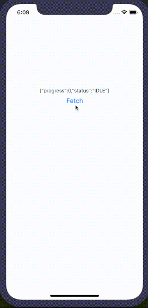

# React Native PACE

 [](https://circleci.com/gh/traveloka/react-native-pace) [](http://makeapullrequest.com)



## Installation

yarn

```
yarn add @traveloka/react-native-pace
```

npm

```
npm i @traveloka/react-native-pace --save
```

## Getting Started

### Basic Usage

```javascript
import React from 'react';
import { Pace } from '@traveloka/react-native-pace';

export default function AwesomeScreen() {
  return (
    <Pace>
      {({ progress, status }) => (
        ...
      )}
    </Pace>
  );
}
```

## Example
// TODO

or

```bash
cd Example
yarn
react-native run-ios
```

## Documentation

### - Pace

#### Importing
```javascript
var Pace = require('react-native-pace').Pace;  // ES5

import { Pace } from 'react-native-Pace';  // ES6
```

#### Children
| variable | Type                  | Default Value | Description         |
| -------- | --------------------- | ------------- | ------------------- |
| progress | number                | 0             | start from 0 to 100 |
| status   | `IDLE | START | DONE` | IDLE          | status of progress  |

#### Props
| Property                     | Type   | Default Value | Description              |
| ---------------------------- | ------ | ------------- | ------------------------ |
| resetDelay                   | number | 1000          | delay from done to idle  |
| config.blackListContentTypes | RegExp | none          | black list content types |
| config.blackListUrls         | RegExp | none          | black list urls          |
| config.whiteListUrls         | RegExp | none          | white list urls          |

## Contributing

We'd to have your helping hand on this package! Feel free to PR's, add issues or give feedback!

## Credits
Written by [Jacky Wijaya](https://www.linkedin.com/in/jacky-wijaya-125b90b6/) (@jekiwijaya) at Traveloka.
